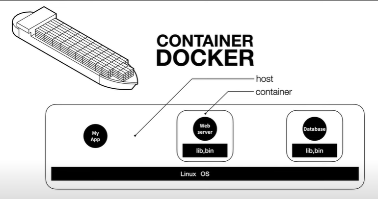
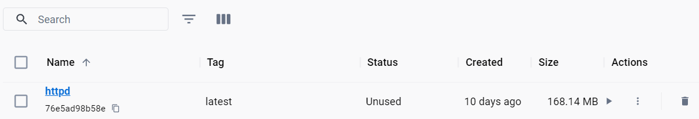
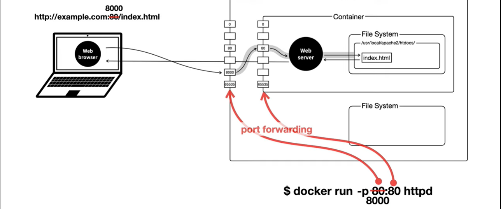
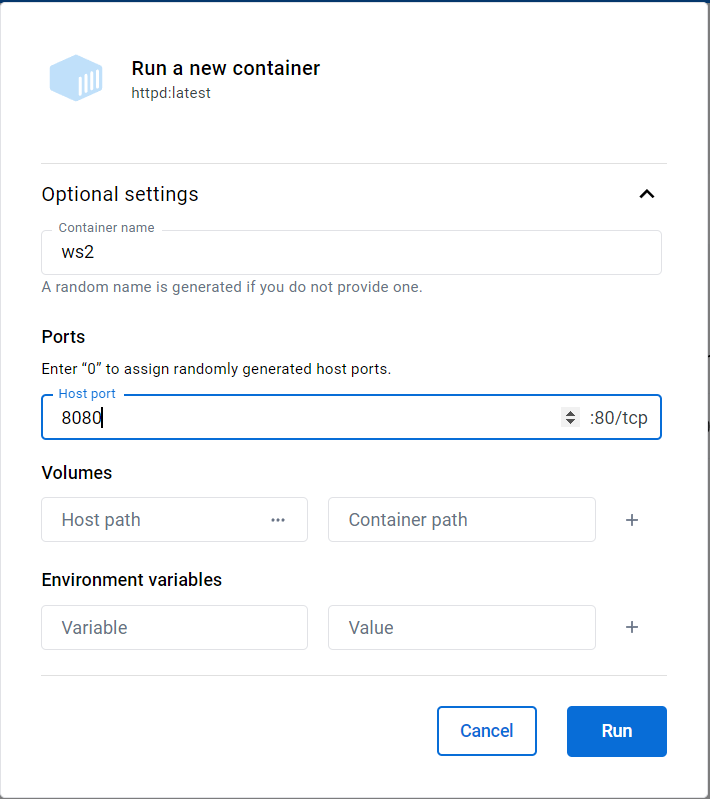

# Docker

<a href="https://www.youtube.com/playlist?list=PLuHgQVnccGMDeMJsGq2O-55Ymtx0IdKWf">생활코딩 Docker 입문</a>

### 1. docker를 왜 쓰는가?

- 새로운 환경을 구성하는 것은 매우 비용이 크다.

> docker 등장 배경

- 하나의 컴퓨터에서 가상 환경을 만들고, 그 위에 운영체제를 설치하고 웹서버 등을 설치하면 물리적인 비용을 제외시킬 수 있다.
- 운영 체제 위에서 또 운영 체제를 띄운다 -> 너무 무거움

---

- 격리된 환경에서 각각의 앱을 실행
  - 이 때 운영체제가 설치된 컴퓨터를 `host`라 지칭
  - 이 때 `host`에서 실행되는 각각의 실행 환경을 `container`라 지칭
- 각각의 `container`에는 운영체제 전체가 설치된 것이 아니다.
  - 앱을 실행하는 데 필요한 라이브러리, 실행파일, 코드 등이 포함된 것이다.
  - 이미 존재하는 운영체제를 공유한다.
    - 무엇인가를 설치할 필요 X, 속도도 느려지지 않는다.
    - 저장장치의 용량을 줄일 수 있다.  
      

### 2. docker 설치

- docker는 리눅스 운영체제 기술이다.
- docker는 리눅스, windows, mac 환경을 모두 지원하며, 리눅스를 제외한 환경에서는 리눅스 가상환경이 필요하다.
  - docker가 알아서 가상머신을 만들어주고, 그 위에 리눅스 설치하며 진행
    - 리눅스를 제외한 환경에서는 어느 정도의 속도 저하를 감수해야하는 이유
    - docker 사용할 때 편의성이 너무나 좋기에 그럼에도 불구하고 사용한다.
- https://docs.docker.com/desktop/install/windows-install/

> docker 이용하기

- CLI환경이 docker 본연의 성능을 이끌어내는 데 최적화

  ```bash
  <!-- windows powersell에서 실행 -->
  wsl --update
  ```

- cmd에서 명령어 사용해서 docker가 제대로 설치됬는지 확인하기
  ```bash
  docker images
  ```

### 3. docker 이미지 pull

- docker hub와 프로그램의 구조 비교  
  
- https://hub.docker.com/
- https://docs.docker.com/
  - https://docs.docker.com/engine/reference/commandline/pull/
- apache를 다운 받는 예시

  ```bash
  <!-- cmd -->
  docker pull httpd
  ```

  

  - 성공적으로 다운로드 받은 것을 확인할 수 있다.

### 4. docker 컨테이너 run

- 이미지를 실행시켜 컨테이너를 만드는 방법

> GUI

- `images`에서 실행(run) 버튼을 통해 컨테이너를 생성할 수 있다.
- `containers`에서 컨테이너를 관리할 수 있는데, 정지 버튼을 통해 컨테이너를 끌 수 있다.

> CUI

- https://docs.docker.com/engine/reference/commandline/run/

  ```bash
  <!-- cmd -->

  <!-- 실행하기 -->
  docker run httpd

  <!-- 컨테이너 확인하기 -->
  docker ps

  <!-- 컨테이너 stop: id를 적거나 name을 적는다. (삭제가 아님) -->
  docker stop ws2
  docker ps

  <!-- 모든 상태의 컨테이너 확인하기 -->
  docker ps -a

  <!-- 재실행 -->
  docker start ws2

  <!-- 로그를 따로 출력해주지 않는다. -> 로그 보기 -->
  docker logs ws2

  <!-- 실시간 로그를 보고 싶을 때 -->
  docker logs -f ws2
  ```

  ```bash
  <!-- cmd -->

  <!-- container 삭제: 실행 중인 것은 바로 삭제 불가능 -->
  docker stop ws2
  docker rm ws2
  docker ps -a

  <!-- 바로 삭제 -->
  docker rm --force 8c1edcbd6704

  <!-- 이미지 삭제 -->
  docker rmi httpd
  ```

### 5. docker - 네트워크

> 선행학습 (알고 들으면 좋은 내용)

- https://opentutorials.org/course/3084
- https://opentutorials.org/course/3265
- 80: http | 433: https

> 네트워크 구조

- 기존 네트워크 구조도
- 두 대의 컴퓨터로 구성
  

---

- docker를 사용한 네트워크 구조도  
  
- 호스트와 컨테이너는 자동으로 연결이 되는 것이 아니라 사용자가 설정해서 연결을 하는 것
- `docker run -p 80:80 httpd`앞은 호스트를 의미하며, 뒤는 컨테이너를 의미한다.

---

- 접속 port가 바뀐다면?  
  
- 다음과 같이 호스트의 포트를 바꿔준다.

> 실습

- GUI  
    
- CLI
  ```bash
  docker run --name ws3 -p 8081:80 httpd
  ```
- localhost:8080/index.html 로 접속해보기

### 6. docker 컨테이너 변경 - 명령어 실행  
- 우리는 컨테이너를 띄웠지만, 이것만으로는 아무것도 할 수 없다.
- 컨테이너 안으로 들어가서 내용을 변경해보고 우리에게 도움이 되는 환경으로 만들어보자.  

> GUI
- 더보기 -> Open in terminal
- ```bash
  pwd
  ```

> CLI
- ```bash
  docker exec ws3 pwd

  <!-- 연결 유지 및 계속 명령 전달 -->
  <!-- vsCode에서 실행 시 bash가 아닌 psl을 사용할 것! -->
  docker exec -it ws3 /bin/sh
  <!-- docker exec -it ws3 /bin/bash -->
  <!-- 위가 있을 수도 있지만 없을 수도 있다. 그 땐 기본 sh를 사용한다.  -->
  ```
- ```bash
  docker exec -it ws3 /bin/bash
  <!-- index.html 파일 위치로 이동 -->
  cd /usr/local/apache2/htdocs/

  <!-- 파일 조작을 위한 apt  -->
  apt update
  apt install nano
  nano index.html
  <!-- nano: https://opentutorials.org/module/3747/22523 -->
  ```

### 7. docker - 호스트와 컨테이너의 파일시스템 연결  
- docker 안의 파일을 직접 수정하는 것은 위험한 작업일 수 있다.  
  - 컨테이너가 사라졌다면? 작업한 내용이 전부 날라간다. -> 컨테이너는 언제든지 생성과 소멸이 이루어질 수 있다는 것을 명심해야 한다.  
- 호스트의 파일이 바뀌었을 때, 컨테이너도 변경될 수 있게 연결하면 어떨까?  
  
  - 보다 안전한 개발을 할 수 있을 것  
    - **실행 환경은 컨테이너에게 맞기고, 파일을 수정하는 것은 호스트에서 진행한다.**  
- ```bash
  docker run -d -p 8888:80 -v C:\Users\PJS\Desktop\homework\git_test\dockerEnv\htdocs:/usr/local/apache2/htdocs/ httpd
  ```
- 절대경로를 복사해서 사용하고, `ctrl + f5`를 통해 캐시를 초기화해야 그 다음부터 갱신이 된다.  
  - 이 부분을 어떻게 더 나은 방법으로 고칠 수 있는지가 현재 궁금한 사항