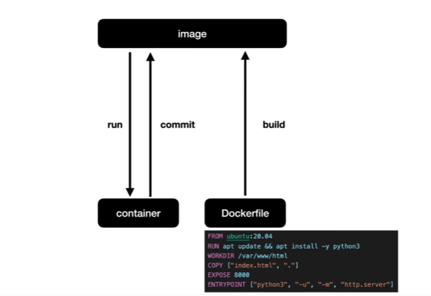

# Docker: 이미지 만들기

- 현재는 docker hub에서 이미지를 다운로드 받고 이를 이용해서 컨테이너를 만들다.
- 우리의 이미지를 만들고, deploy를 해보자.  
  
  - 가지고 있는 컨테이너를 커밋(백업)해서 만들 수 있다.
  - `Dockerfile`을 통해 만들(build) 수 있다.
- commit 방식

  ```bash
  docker run --name web-server -it unbuntu:20.04

  ---
  <!-- 커밋 후 -->
  <!-- 파이썬3 안에는 웹서버가 내장되어 있기에 설치 -->
  apt update
  apt install python3
  <!-- -p 를 넣는 이유는 /var/www가 없기 때문에 없으면 만들라는 명령 -->
  mkdir -p /var/www/html
  cd /var/www/html
  echo "Hello, <strong>Docker</strong>" > index.html
  python3 -m http.server
  ```

  ```bash
  <!-- 별도의 psl에서 -->
  docker commit web-server web-server-commit
  ```

- build 방식

  ```bash
  <!-- docker 파일 -->
  FROM ubuntu:20.04
  ```

  ```bash
  docker build -t web-server-build .
  ```

  ***

  ```bash
  <!-- docker 파일 -->
  <!-- 파이썬3 설치 -->
  <!-- &&의 의미는 앞이 성공하면 뒤를 실행한다는 것, -y는 중간에 창이 뜨지 않게 하기 위해서 -->
  FROM ubuntu:20.04
  RUN apt update && apt install -y python3
  WORKDIR /var/www/html
  # RUN echo "Hello, <strong>Docker</strong>" > index.html
  # 위를 COPY를 통해 해결  
  # COPY ["index.html", "."]
  # -u 옵션을 써야 현재 상태, 로그가 화면에 출력
  # run은 빌드가 되는 시점에 -> img, cmd는 컨테이너에 시행되는 결과 -> cmd
  # CMD ["python3", "-u", "-m", "http.server"]
  ```

  ```bash
  docker build -t web-server-build .;
  docker rm -f web-server;
  docker run -p 8888:8000 --name web-server web-server-build pwd;
  <!-- cmd는 자동으로 실행하지 않기 위해서 pwd를 넣음. pwd가 대신 실행됨 -->
  <!-- pwd는 cmd를 overriding 하기 위함(시작 명령을 변경할 수 있음) -->
  <!-- 그래서 웹서버가 자동으로 실행되지 않음 -->
  ```