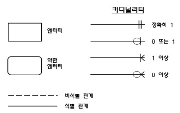

> 데이터 모델링이란?

- 정보시스템을 구축하기 위한 데이터 관점의 업무 분석 기법
- 현실 세계의 데이터(what)를 약속된 표기법으로 표현하는 과정
- 데이터베이스를 구축하기 위한 분석 및 설계의 과정

> 데이터 모델링 유의점

- 중복(Duplication)
  - 데이터 모델은 같은 데이터를 사용하는 사람, 시간, 그리고 장소를 파악하는 데 도움을 주어 데이터베이스가 여러 장소에 같은 정보를 저장하는 잘못을 하지 않도록 한다.
- 비유연성(Inflexibility)
  - 데이터 모델을 어떻게 설계했느냐에 따라 사소한 업무변화에도 데이터 모델이 수시로 변경되어 유지보수의 어려움을 가중시킬 수 있다. 데이터의 정의를 데이터의 사용 프로세스와 분리함으로써 데이터 모델링은 데이터 혹은 프로세스의 작은 변화가 애플리케이션과 데이터베이스에 중대한 변화를 일으킬 수 있는 가능성을 줄인다.
- 비일관성(Inconsistency)
  - 데이터 중복이 없더라도 비일관성은 발생할 수 있는데, 예를 들면 신용 상태에 대한 갱신없이 고객의 납부 이력 정보를 갱신하는 경우이다. 개발자가 서로 연관된 다른 데이터와 모순된다는 고려없이 일련의 데이터를 수정할 수 있기 때문에 이와 같은 문제가 발생할 수 있다. 데이터 모델링을 할 때 데이터 간의 상호 연관 관계에 대해 명확하게 정의하지 않는다면 이러한 위험을 사전에 예방하는 데 도움을 줄 수 있다.
  - 사용자가 처리하는 프로세스 혹은 이와 관련된 프로그램과 테이블의 연계성을 높이는 것은 데이터 모델이 업무 변경에 대해 취약하게 만든다는 단점에 해당한다.

> 데이터 모델링

- 개념적 모델링
- 논리적 모델링
- 물리적 모델링

> 데이터 베이스 스키마 구조 3단계(데이터 독립성 요소)

- 외부 스키마: 개개의 사용자가 보는 개인적 DB 스키마
- 개념 스키마: 모든 사용자 관점을 통합한 전체 DB
- 내부 스키마: 물리적 장치에서 데이터가 실제적 저장
- 스키마(컴퓨터 데이터 베이스 스키마): `데이터 구조` 또는 `데이터 베이스의 설계`를 의미

> 데이터 독립성

- 논리적 독립성: 개념 스키마 변경, 외부 스키마 영향 X
- 물리적 독립성: 내부 스키마 변경, 외부/개념 스키마 영향 X

> mapping(사상): 상호 독립적인 개념을 연결시켜주는 다리

- 논리적 사상: 외부 스키마 - 개념 스키마
- 물리적 사상: 개념 스키마 - 내부 스키마

> 데이터 모델링의 3요소

- 어떤 것(Things)
- 성격(Attributes)
- 관계(relationships)

> 모델링의 특징

- (현실 세계) -> 추상화, 단순화, 정확화 -> (모델)

> 데이터 모델 표기법

- 1976년 피터 첸이 Entity Relationship Model 개발
  - IE, Baker 기법이 많이 쓰임
  - 엔터티, 관계, 속성으로 이루어짐

> ERD 작성 순서

1. 엔터티를 그림
2. 엔터티를 배치
3. 엔터티 관계 설정
4. 관계명 기술
5. 관계 참여도 기술
6. 관계 필수 여부 기술

 

- 
- 식별 관계: 부모 테이블의 기본키 또는 유니크 키를 자식 테이블이 자신의 기본키로 사용하는 관계
- 비식별 관계: 부모 테이블의 기본키 또는 유니크 키를 자신의 기본키로 사용하지 않고, 외래키로 사용하는 관계입니다.

> 좋은 데이터 모델의 요소

1. 완전성: 업무에 필요한 모든 데이터가 모델에 정의
2. 중복배제: 하나의 DB내에 동일한 사실은 한번만
3. 업무규칙: 많은 규칙을 사용자가 공유하도록 제공
4. 데이터 재사용: 데이터가 독립적으로 설계되어야 함
5. 의사소통: 업무규칙은 엔터티, 서브타입, 속성, 관계 등의 형태로 최대한 자세히 표현
6. 통합성: 동일한 데이터는 한번만 정의, 참조 활용
