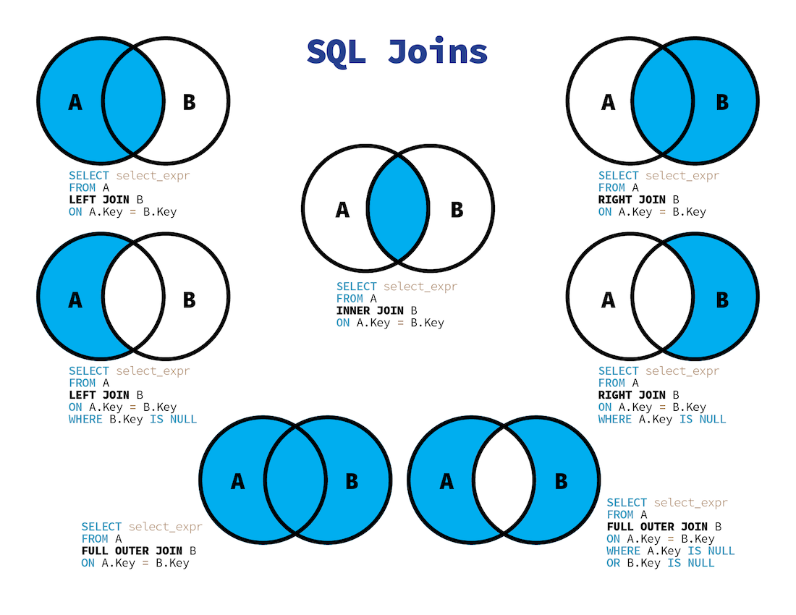

> 관계와 조인

- https://yunamom.tistory.com/195
- 

- 관계: 상호 연관성이 있는 상태
- 조인: 식별자를 상속하고, 상속된 속성을 매핑키로 활용하여 데이터를 결합하는 것을 의미한다.
- 계층형 데이터 모델: 계층 구조를 가진 데이터 자기 자신을 조인할 수 있다.(Self-Join)
- 상호 배타적(Exclusive-OR) 관계: 엔티티가 두 개 이상의 다른 엔티티의 합집합 관계를 갖는 것
