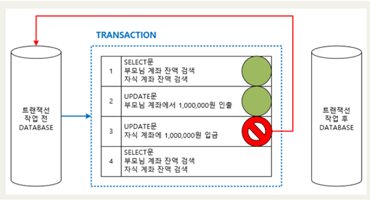
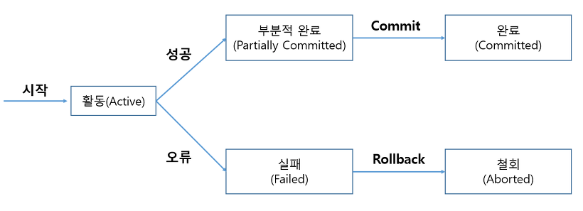

> 트랜잭션(Transaction)

- https://yunamom.tistory.com/195
- 데이터베이스의 논리적 연산단위
- 데이터 정합성을 위해서 전부 실행되던지 아니면 전부 취소되야 하는 단위
- 반드시 하나의 업무 단위로 묶여서 처리되어야 한다.
  

> 트랜잭션(Transaction)의 특징(ACID property)

- 원자성(Atomicity)
  - 트랜잭션 실행 도중에 문제가 발생했을 경우, 중단된 상태가 아닌 모두 실패하거나, 모두 완성 둘 중 하나의 상태가 되어야 합니다.
  - 즉 100개 명령어로 구성된 트랜잭션 중 99개 완료 1개 실패가 된다면, 이는 무조건 실패로 간주하여 트랜잭션 시작 전 상태로 돌려야 합니다.
  - 또한, 100개 모두가 성공했을 시 트랜잭션은 성공합니다. 따라서 중간상태란 없습니다.
- 일관성(Consistency)
  - 트랜잭션 완료 후에도 데이터베이스가 일관된 상태로 유지되어야 합니다.
  - 예를 들어 계좌이체를 성공적으로 실행했다면, A계좌의 잔액과 B계좌의 잔액의 합이 트랜잭션 실행 전의 합과 동일해야 합니다.
- 고립성(Isolation)
  - 고립성이란 하나의 트랜잭션이 실행하는 도중에 변경한 데이터는 이 트랜잭션이 완료될 때까지 다른 트랜잭션이 참조하지 못하게 하는 특성입니다.
  - 하나의 트랜잭션이 A라는 계좌에서 작업을 하고 있다면, 다른 트랜잭션이 A계좌에 대해 참조하거나 관여 할 수 없고 작업이 끝날 때까지 대기하거나 해야합니다.
- 지속성(Durability)
  - 지속성은 트랜잭션이 완료되면, 주기억장치가 아닌 디스크와 같은 보조기억장치에 저장되거나 그렇지 않더라도 시스템 장애가 회복되고 난 후에 어떠한 형태로든지 그 데이터를 복구 할 수 있게 해야함을 뜻합니다.

> 트랜잭션의 생명주기

- 
- Active(활동)
  - 트랜잭션이 실행 중에 있는 상태, 연산들이 정상적으로 실행 중인 상태
- Failed(장애)
  - 트랜잭션이 실행에 오류가 발생하여 중단된 상태
- Aborted(철회)
  - 트랜잭션이 비정상적으로 종료되어 Rollback 연산을 수행한 상태
- Partially Committed(부분 완료)
  - 트랜잭션이 마지막 연산까지 실행했지만, Commit 연산이 실행되기 직전의 상태
- Committed(완료)
  - 트랜잭션이 성공적으로 종료되어 Commit 연산을 실행한 후의 상태
