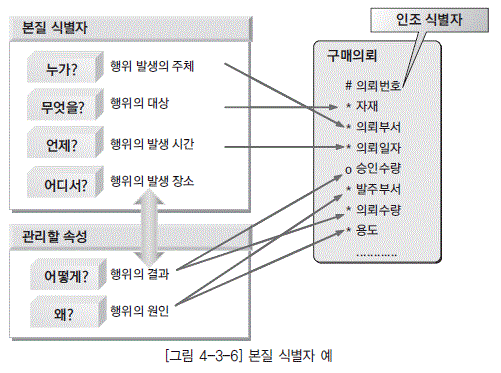

- 본질식별자: 업무에 의해 만들어진 식별자
- 인조식별자: 업무적으로 만들어지지는 않지만 본질식별자가 복잡한 구성을 갖고 있으므로 인위적으로 만든 식별자
  - 인조식별자는 대체로 본질식별자가 복잡한 구성을 가질 때 만들어진다.
  - 인조식별자를 사용하면 중복 데이터를 막기 어려워진다.
  - 인조식별자를 사용하면 본질식별자를 사용할 때와 비교해서 추가적인 인덱스가 필요하다.
  - 인조식별자는 단점도 존재하므로 꼭 필요한 경우에만 사용하는 것이 바람직하다.
- 
